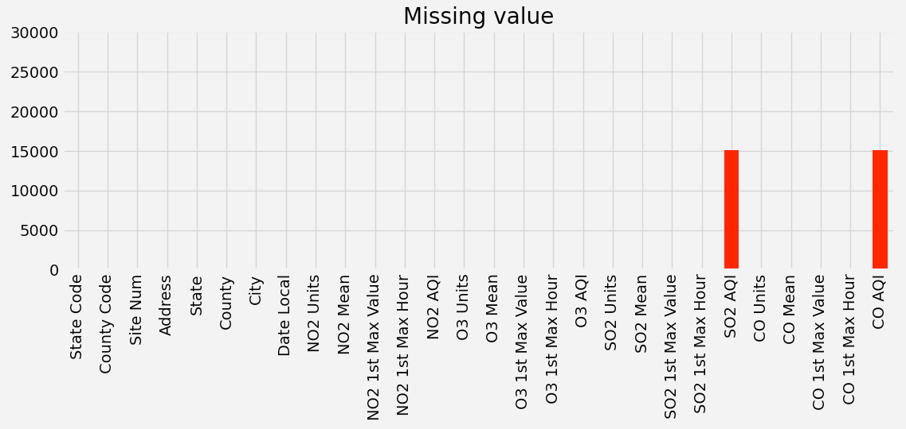
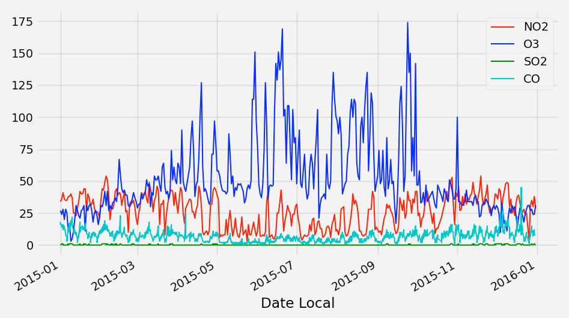
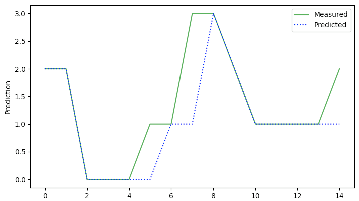

## Stay at home - pollution prediction in US

I've chosen [U.S. Pollution Data](https://www.kaggle.com/sogun3/uspollution)
dataset to predict future air quality and suggest people to stay at home or not.

> This dataset deals with pollution in the U.S. Pollution in the U.S. has been well documented by the U.S. 
> EPA but it is a pain to download all the data and arrange them in a format that interests data scientists.
> Hence I gathered four major pollutants (Nitrogen Dioxide, Sulphur Dioxide, Carbon Monoxide and Ozone) for 
> every day from 2000 - 2016. There is a total of 28 fields. The four pollutants (NO2, O3, SO2 and O3) each 
> has 5 specific columns. Observations totaled to over 1.4 million.

### Getting started

Before running scripts you have to download the dataset there from kaggle and add it to /data directory.

After running setup.py follow:
```console
python simplify.py
python process.py
python learn.py
python run.py
```

### Quick explanation

An air quality index (AQI) is used by government agencies to communicate to the public how polluted the air 
currently is or how polluted it is forecast to become. Public health risks increase as the AQI rises. 
Different countries have their own air quality indices, corresponding to different national air quality standards. 
Some of these are the Air Quality Health Index (Canada), the Air Pollution Index (Malaysia), and the Pollutant 
Standards Index (Singapore). For more information check out [Wikipedia page](https://en.wikipedia.org/wiki/Air_quality_index).

```
Value    |  Label
-------------------------------------------
0-50     |  Good (0)
51-100   |  Moderate (1)
101-150  |  Unhealthy for Sensitive Groups (2)
151-200  |  Unhealthy (3)
201-300  |  Very Unhealthy
301-500  |  Hazardous
```

However, this classification is unnecessary in this study, therefore it has been limited to four 
(where the last range is between 151-500). 

#### Preprocessing

The data set contains measurements for SO2, CO, NO2 and O3. As in the case of weather forecasts, here also the data has been limited to one location. After a short analysis, it turned out that some AQI values were missing. 



Having the maximum values of pollutions, calculating the index was not a problem at all using the formula from Wikipedia.

The number of measurements of the set during each day is not standardized. In some years, these are four, in other 
even six, so taking it into account, the data was grouped by days and the average value of all of those was calculated. 



#### Analysing results

More than 50 models in various configurations have been trained. The network very quickly reached a precision around 73%.
Even if the network was wrong it was still close to the measured value. For instance, whenever it decided that on a given 
day it will be 1 (moderate), and it turned out to be 2 (unhealthy for sensitive).


