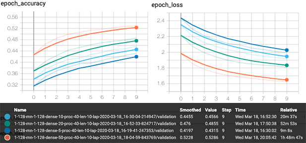

## Text Generation

I have used [freeCodeCamp Gitter Chat](https://www.kaggle.com/freecodecamp/all-posts-public-main-chatroom)
dataset to perform basic text generation. 

> The files contains the posts from students, bots, moderators and contributors in the main ("/freeCodeCamp") 
> Gitter chatroom between 31-Dec-2014 until the first days of Dec-2017. There are around 5 million posts from 
> near 400,000 users (all estimates). Data was extracted using Python code over the Gitter API. Records are not 
> anonymised or modified and are presented "as they are".

### Getting started

Before running scripts you have to download the dataset there from kaggle and add it to /data directory.

After running setup.py follow:
```console
python process.py
python learn.py
python run.py
```

### Quick explanation

The most important step in neural networks is understanding the data on which you operate and finding
relevant information for the specific problem. To obtain a reliable model, the first step will 
be to filter data to one user.

#### Preprocessing


The user called Serenity has the largest number of messages (over 140,000) and is not a bot, making him an excellent candidate 
for further processing. Looking deeper into his messages, you can see that he is interested in a topic related to web 
development (phrases like Bootstrap, CSS etc.). 

```
224937    Hello... I heard about Free Code Camp via Lifehacker (I think: it was a feed...
224977    So, just going through the prescribed steps (hello world etc.) have a mix of...
225004    Looking for some idea on the average amount of time (yes, subjective and var...
225053    ok, I found the documentation (I'm new) on the general timelines things take...
225099    at what point does pair coding come into the picture? (am new and also a Lin...
247053    do some amount of BASH here as well. Have to sometimes unlearn white space w...
247090    With all of the various frameworks (even some being learned in course) being...
247105    I'd like to see more variety in design as well. I think it's part 'where peo...
247114    does the sameness (not specifically Bootstrap, but in general) begin to shap...
247126    I've found that compiling a list (your own + links to) of stuff helps.  A lo...
247127                                                                     syntax that is
253298                 I find geany to be pretty solid (as far as editors go). Ugly, yes.
253324    I'd imagine if you had experience programming desktop apps, it wouldn't be d...
253325                                                                          edit: too
253912    I think (in addition to Monospace vs. Monotype) you can also put font-size a...
253918                                        good to hear. CSS is more forgiving than js
253924    Very true. Sloppy code not only affect you, but the person (in production ye...
253926                                                                            affects
253931    Why do you have to loop through each character vs. "uppercasing" the entire ...
253933                                            oh, I see (not critique, just curious )
253941                            I see . @mrxinu - I haven't gotten to that exercise yet
253955    the js exercises are a little quirky in the way they progress (i.e., keeping...
253968                        If you're not making mistakes, you're doing something wrong
256538    even if I have to use a vm, I find anything with a KDE desktop helps workflo...
256590    no gig is 'more poverty' inducing than gig. Get one (gig) then evaluate whet...
256613    I see a lot of dollar figures (which of course is important) thrown around, ...
```

Most of the data is quite redundant for me so the dataset has been reduced to only connected messages.

#### Analysing results

There is a compressed log file that contains already learned configurations. Unzip it run: 

```console
tensorboard --logdir=logs/
``` 

As there more than 40 configurations here so only those which use 80% of the dataset were plot:


At first glance you can immediately see how the loss and precision charts differ from each other. At some point 
(around the 10th epoch), some models on the loss chart begin to change direction from downward to upward. This behavior 
of the network is undesirable, since it starts to make more and more mistakes with each next iteration. It can be concluded 
that the greater number of epochs is not a parameter that should be taken into account in this case. Despite the different 
configurations, the network behaves slightly better around the 10-20th epoch, than at the end of the training.
However, the network is stable and highly predictable regardless of the configuration. Adding more layers or manipulating
density only slightly affects the quality of the final result. 



Although the set is huge, each additional percentage of the data significantly improves the quality of the network.
The simple configuration used in the above case is already a good proof that having a sophisticated set is 
a key to succeeded.

A fragment of text starting with the phrase about jQuery was used for testing proposes. It worth highlighting that 
each set contains 40 characters and the generated content have 400 characters. Therefore, after the first 40 
characters, the content is completely generated based on the prediction. 

```
Used fragment:  "jquery is a helpful library that works"
Diversity: 0.2
 jquery is a helpful library that works that you can also want to see the second that is a lot of the context of the complete that i was a complex that i think that would be a company that would be a lot of something that would be a lot of the comparing the for the company it's not a complex in the context of the second of the head of the context of the compare that i don't have the free to do a lot of the things in the part of the also
Diversity: 0.5
 jquery is a helpful library that works (and you can get the entire that you're in the search in the things of stuff in the comment) @progoaz  i think the scroll for the large in the world person (and another thing) was a lot of comment with a project thing (i think there are for eat you like the same to the color really think of it one that you can see the netware (and it will take what i think i get the format (maybe should say that t
Diversity: 1.0
 jquery is a helpful library that works in that mgl say ah geer that it kird of standle) now if i have or lol) t at this ruse n n you're on presifes) town that papper external either whatever cool way with found. try might add outside.. (it's gone to something me miking the 't the same it globally, that kind of an unation formatted precent than what you've really in starbucks is in plugin in the level s1 overself because and haven't don
Diversity: 1.2
 jquery is a helpful library that works don't use hit alien my mper(s? around in no thing' those the whole question in a still eglist of mongo no ahead second oh, yes yeah, you can you purtonall you so :sgillen - str without the retactly yeah, starts s'chlemp```fw"```inmeind restwing dev)   it's 'ktmea  yourself) nice: that's wrapking blag. lol *i'm pretty much sice to musics though) i want something is love slicely getting your phoni
Original long:
 jquery is a helpful library that works in a lot of contexts, for learning... it's likely that jumping into vanilla js for dom interaction would be counterproductive to pacing again, heed the m&m warning i use pretty'fiers. i'm bad @combsco :wave:  it 'works' because (like you say) they (apple) control everything in their walled paradigm... i don't dig that so much (but use apple products too) but
``` 

There is a high chance that increasing the length of the sequence and the density would make the accuracy even higher.
However, this is only an experimental project, created primarily for the needs of building the whole environment. 
All requirements have been met, tools have been configured and work simplified for a future research.
