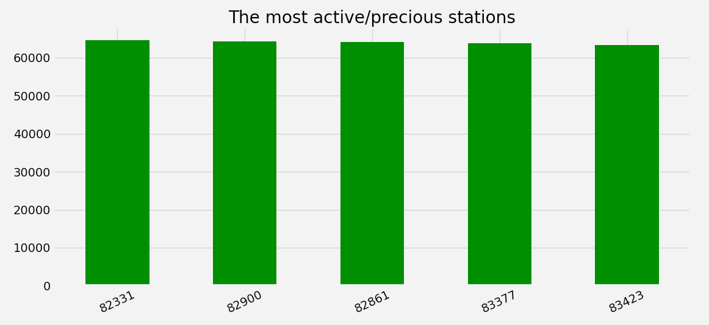
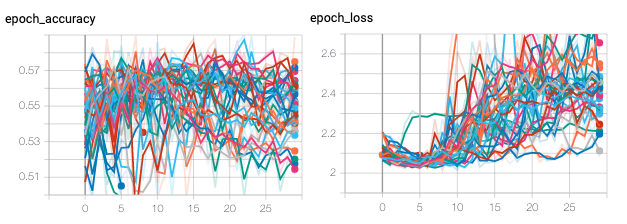
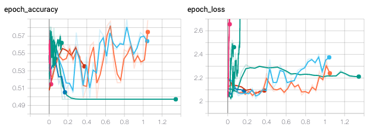
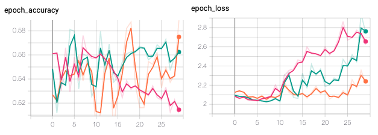
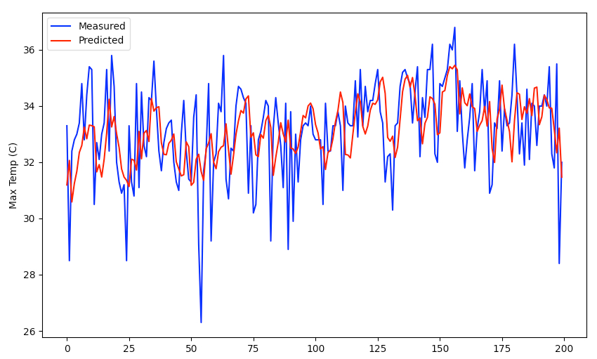
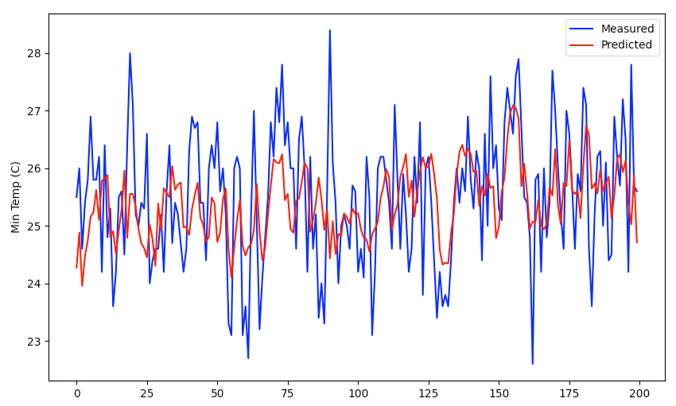

## Brazil Weather Forecast

I decided to use [Brazil Weather (1961 - 2019)](https://www.kaggle.com/saraivaufc/conventional-weather-stations-brazil)
dataset weather forecasting. If there's gonna be more time maybe some sort of suggesting based mechanism 
like "should I take an umbrella?"

> Meteorological data observed in conventional meteorological stations of the National Institute of 
> Meteorology - INMET distributed in the Brazilian territory from 1961 to 2019.

### Getting started

Before running scripts you have to download the dataset there from kaggle and add it to /data directory.

After running setup.py follow:
```console
python simplify.py
python process.py
python learn.py
python run.py
```

### Quick explanation

The table labels are in Brazilian language, so the first step was to translate them. 

#### Preprocessing

To understand the set, a preliminary analysis was made by counting the number of individual measurements 
at different stations. The total number of measurements is over 12 million, which itself shows the scale of this experiment. 
Trying to limit the amount of data, the station with the largest number of measurements was searched (it will 
not be necessary to specify the location as an input field to the network, which suppose to significantly 
increase its precision). Obviously, the location prediction would be very interesting, but the computing power 
needed for this could be huge due to the number of measurements.



#### Analysing results

Over 40 different configurations were generated in two days. The problem is that displaying all of them on one chart
(using horizontal axis step value) makes it impossible to conclude anything meaningful.



In such a situation, a relative value should be used, which contains much more valuable information for analysis.



Most models behave better in the first epochs. The whole prediction varies between 51 and 58% accuracy. The models
has been selected as the best.



Only two networks managed to achieve high results in more epochs than 5-10. The two most complex architectures were
able to keep the loss value relatively low for a long time (and still improve).

Finally, the network was executed to see how it performs comparing to what happened in reality.



The network regularly found trends, however, by using scaling instead of standardization, anomalies were out of the 
scope of the prediction. Despite that, it is impressive how well the network coped measured data. It is worth 
mentioning that the whole was based only on the last 14 days.



Various studies have proven that Fourier transformations could help with anomalies, however, the sequence
mechanism from RNN is a very promising concept to keep and track the context of the data.